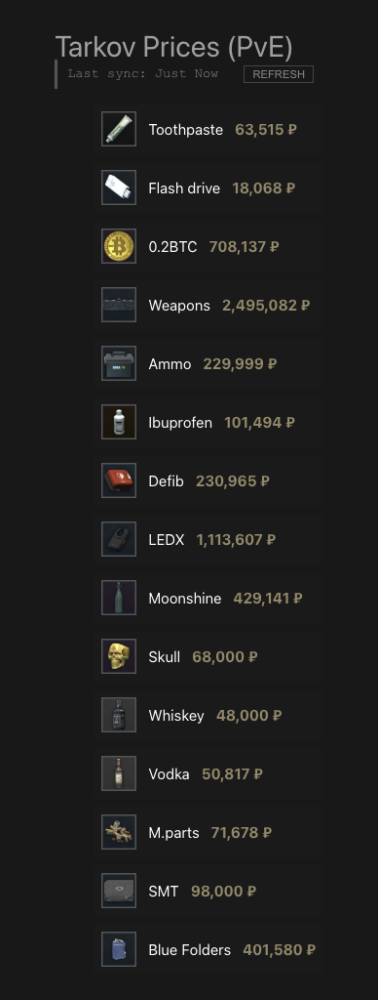

# Go tarkov.dev API

## Setup
`./goWasm.sh` to compile wasm

## Acknowledgement
[Tarkov.dev](https://tarkov.dev) for Tarkov's API

[Official guide](https://go.dev/wiki/WebAssembly) for compiling Go into WASM

[This post](https://medium.com/@kiril2315/wxt-vue-go-wasm-build-modern-web-extensions-9ee245d0e971) for structuring